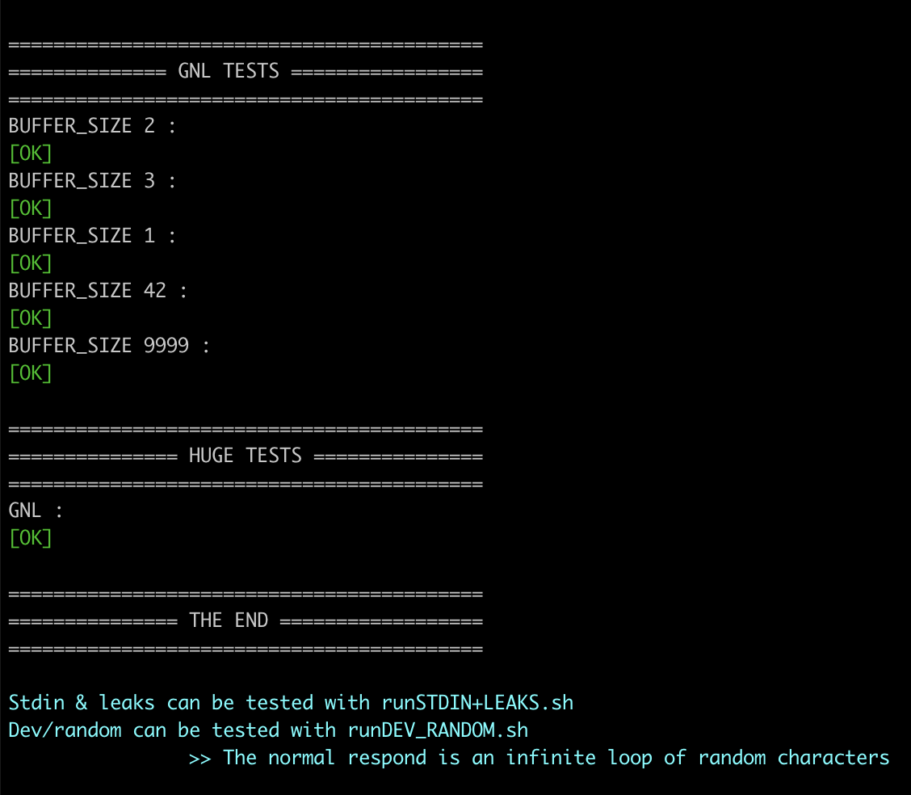
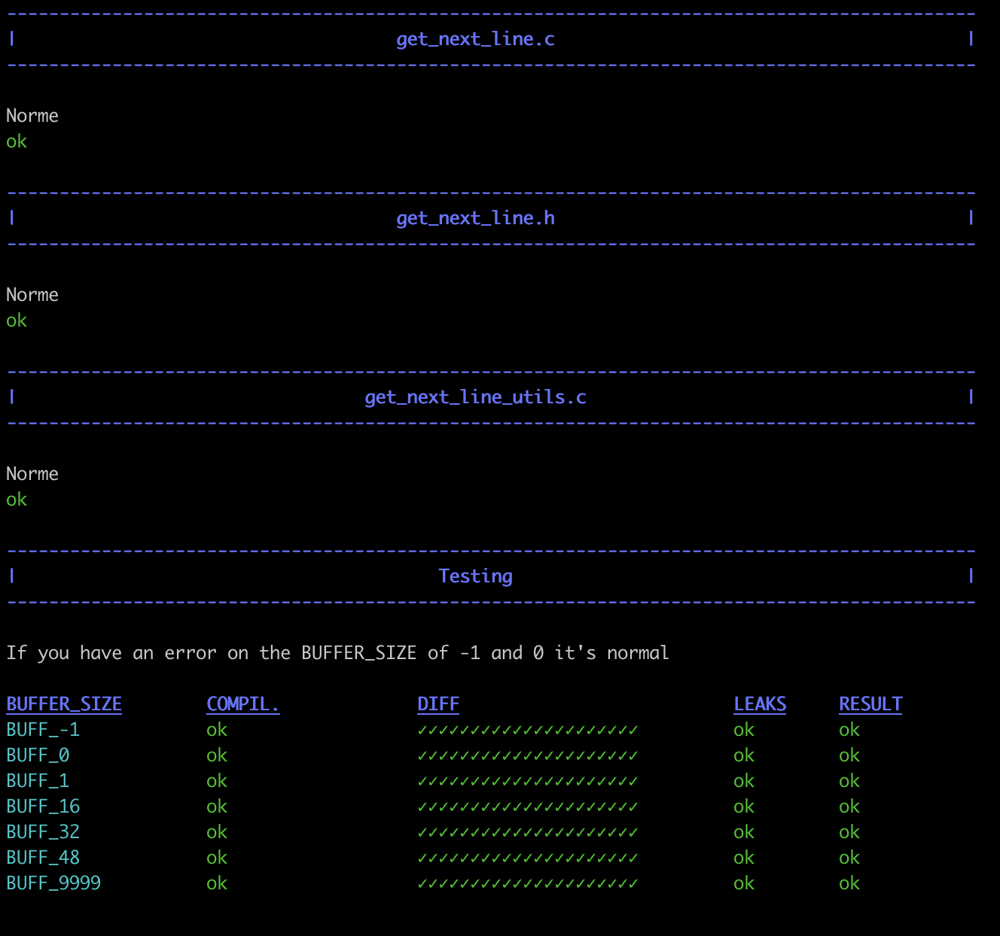

# get_next_line

GNL is a School 42 project.

## TASK

Code a function that returns a line ending with a newline, read from a file descriptor.

### Return value

* If any error or memory was not allocated:	`return (-1);`
* If all went good and EOF:	`return (0);`
* If all went good and not EOF:	`return (1);`

## Compilation

Use something like this in `main.c`:
```
#include "get_next_line.h"
#include <fcntl.h>
#include <stdio.h>

int		main()
{
	int i;
	int j;
	int fd;
	char *line;

	fd = open("text.txt", O_RDONLY)
	while ((i = get_next_line(fd, &line)) > 0)
	{
		printf("|%s\n", line);
		free(line);
		j++;
	}
	printf("|%s\n", line);
	free(line);
	close(fd);
}
```

Compile with `BUFFER_SIZE` > 0. Limited by stack size.

`gcc -D BUFFER_SIZE=32 main.c get_next_line.c get_next_line_utils.c`


## DETAILS

Project coded according to the 42 norms. No C standard library functions were used. `get_next_line_utils.c` contains my implimintation of 5 functions needed to code `get_next_line` project.

`ft_strjoin()` also `free()` the memory on which first pointer pointed to.


## TESTS

</img>

[42TESTERS-GNL](https://github.com/Mazoise/42TESTERS-GNL)

</img>

[gnl-war-machine-v2019](https://github.com/Alexandre94H/gnl-war-machine-v2019)
